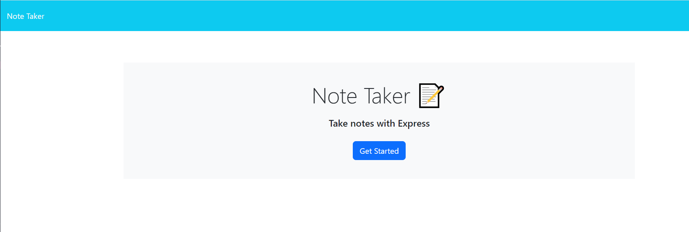
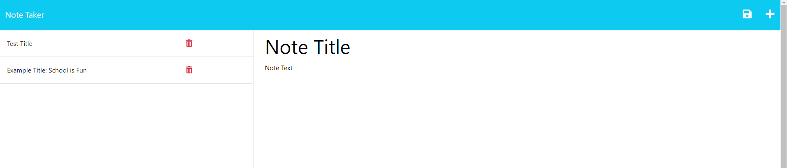

# Thought Tracker

## Description

Keep track of all of your thoughts, hopes, and dreams with this Thought Tracker! If you have a title for your note and some interesting thoughts underneath, your note will be stores to the left of the page. 

## Installation

N/A

## Usage

From the Note Taker Homepage, just click the button that says  "Get Started" and you will be taken to the area where you can enter your notes.

At first, the save button for a note won't populate because we don't want to save empty notes, but, once you type in a title and some thoughts, you're able to click the save button at the top right of the page and add the note to your list on the left of the page.

## Link

Here's the link to check out your new thought tracker!

<a href="https://enigmatic-bastion-37302.herokuapp.com/">Live Link</a>